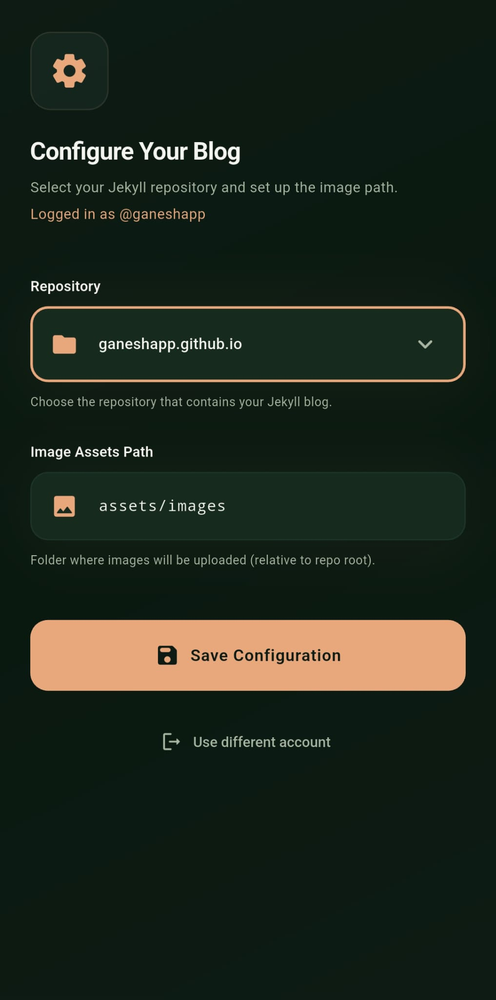
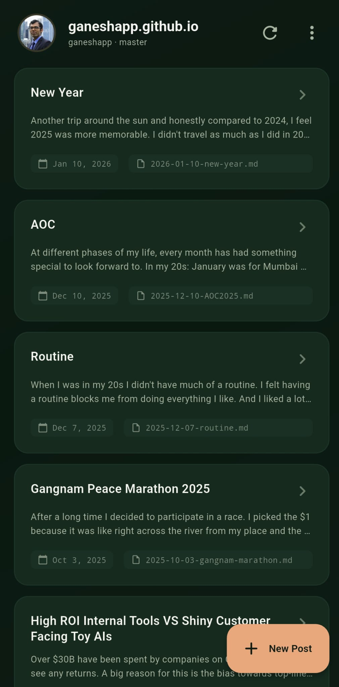
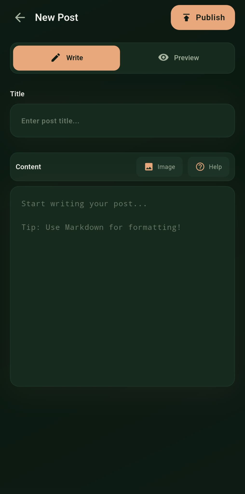
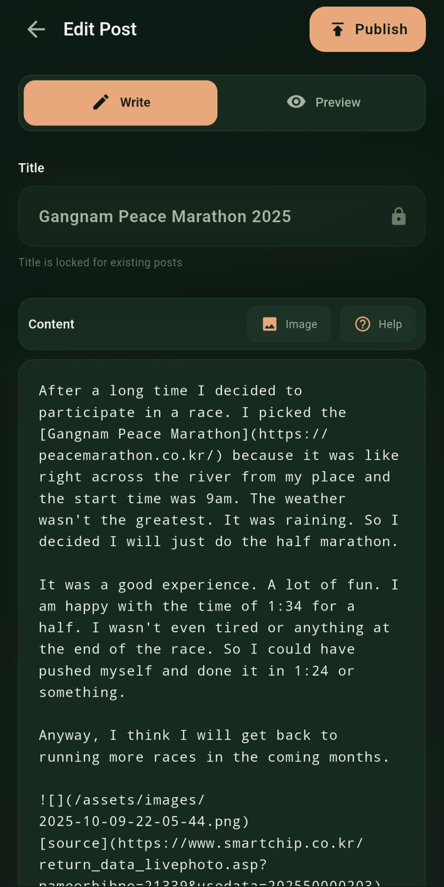
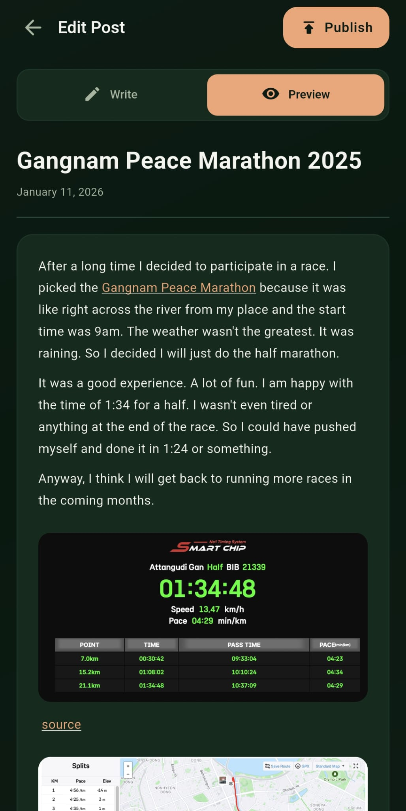

# JekyllPress

<p align="center">
  
</p>

<p align="center">
  <strong>A polished, mobile-first CMS for any Jekyll blog hosted on GitHub.</strong>
</p>

<p align="center">
  <a href="https://github.com/ganeshapp/JekyllPress/releases/latest">
    
  </a>
  <a href="https://github.com/ganeshapp/JekyllPress/releases/latest">
    
  </a>
  <a href="LICENSE">
    
  </a>
</p>

> Stop using VS Code to write blog posts. Stop fighting with Git on your phone.

## Screenshots

<p align="center">
  
  
  
  
  
</p>

<p align="center">
  <sub>Configure → Browse Posts → Create → Write Markdown → Live Preview</sub>
  <br/>
  <sub>Screenshots are from v1; v2 keeps the same look with more screens (drafts, post settings, device-flow sign-in).</sub>
</p>

## Disclaimer
I use AI to help me code. But I review all the edits.

## Download

**[Download Latest APK](https://github.com/ganeshapp/JekyllPress/releases/latest)** (Android only)

---

## What it does

JekyllPress treats your GitHub repository like a headless CMS, via the GitHub
REST API — no clone, no git commands, no merge conflicts.

### Writing & publishing
- **Markdown editor** built for phones: internal scrolling, undo/redo, spell
  check, sentence auto-capitalization, live preview tab.
- **Front matter without YAML**: a Post settings sheet for date/time, layout,
  categories, and tags. Custom front matter fields on existing posts are
  preserved byte-exact. New posts default to minimal front matter (`title` +
  `date`) so your site's `_config.yml` defaults apply.
- **Photos**: picked or shot in-app, compressed to ~1080p JPEG, EXIF/GPS
  stripped, uploaded to your assets folder, markdown inserted automatically.
- **Videos**: re-encoded to H.264 with the short edge capped at 640px (25MB
  upload cap) and embedded with an HTML5 `<video>` snippet.
- **Jekyll drafts**: save to `_drafts` on GitHub, promote to post later.
- **Local drafts & autosave**: every keystroke is safe; resume or discard on
  reopen.
- **Offline queue**: publish while offline and it goes out automatically when
  connectivity returns.
- **Conflict-safe**: stale-SHA retries, duplicate-filename auto-suffixing, and
  a proper conflict dialog when the post changed on GitHub while you edited.
- **Delete, search, view post** (permalink-aware, including custom
  `permalink:` patterns read from your `_config.yml`).

### Works with any Jekyll site
- Configurable **posts folder** (`_posts` anywhere, including `docs/_posts`),
  **drafts folder**, and additional **collection folders** with a one-tap
  switcher on the dashboard.
- **Branch picker** — publish to any branch, not just the default.
- **Project sites**: `baseurl`-aware image URLs and post links.
- Posts in **subfolders** (year/category layouts) are found via the git trees
  API, with no 1000-file cap.
- Private repositories fully supported (including preview images).

---

## Signing in

Two options. No client ID ships in the app, so Device Flow needs a free GitHub
App you register once yourself (details below); a Personal Access Token needs
nothing but the app.

### Option A — Sign in with GitHub (Device Flow, recommended)

No token to paste, and permissions can be scoped to just your blog repo. It
requires a free GitHub App that **you register once on your own account** (so
no one else's server ever sees your tokens):

1. Go to **[github.com/settings/apps/new](https://github.com/settings/apps/new)**.
2. Name it anything (e.g. `my-jekyllpress`), set any homepage URL.
3. Uncheck **Webhook → Active** (not needed).
4. Under **Permissions → Repository permissions**, set **Contents** to
   **Read and write**.
5. Check **Enable Device Flow**.
6. Create the app, then copy its **Client ID** (`Iv23...`).
7. Install the app on your account and select your blog repository
   (`github.com/apps/<your-app-slug>/installations/new`).
8. In JekyllPress, tap **Sign in with GitHub** and paste the Client ID when
   asked — this is a one-time step; the app remembers it.

You'll get an 8-character code (auto-copied), approve it on
`github.com/login/device`, and you're in. Tokens auto-refresh; nothing to
maintain.

**Building from source?** You can bake your own Client ID into the APK and
skip step 8 entirely:

```bash
flutter build apk --dart-define=GITHUB_CLIENT_ID=Iv23xxxxxxxxxxxxxxxx
```

### Option B — Personal Access Token

Create a token with `repo` scope (or a fine-grained token with Contents
read/write on your blog repo) and paste it into the login screen's
"Use a Personal Access Token instead" section.

Either way, the credential is stored in Android's Keystore-backed encrypted
storage and only ever sent to GitHub. See [PRIVACY.md](PRIVACY.md).

---

## Configuration

After signing in, pick a repository (yours, org, or collaborator — or type
`owner/repo` manually). JekyllPress detects Jekyll sites, then lets you
confirm:

| Setting | Default | Notes |
|---------|---------|-------|
| Branch | repo default | any branch; reads and writes both use it |
| Posts folder | `_posts` | any path, e.g. `docs/_posts` |
| Drafts folder | `_drafts` | for GitHub-side drafts |
| Collections | — | extra content folders (e.g. `_notes`), switchable on the dashboard |
| Assets folder | `assets/images` | where photos/videos upload |
| Site URL + baseurl | inferred | powers "View post" links and project-site image URLs |
| Front matter defaults | none | optional layout/categories/tags pre-filled for new posts |

---

## Tech Stack

* **Framework:** [Flutter](https://flutter.dev) (Android target)
* **State Management:** [Riverpod](https://riverpod.dev) (codegen)
* **Networking:** [Dio](https://pub.dev/packages/dio) — one shared authenticated client
* **Local DB:** [Hive](https://docs.hivedb.dev/) (posts cache, drafts, config, publish queue)
* **Secure Storage:** [flutter_secure_storage](https://pub.dev/packages/flutter_secure_storage) (tokens)

### Design choices

* **REST API, not git**: no history download, tiny footprint. Trade-off: no
  merges — the API's SHA checks protect against clobbering, and the app
  surfaces conflicts with an overwrite/keep-both choice.
* **Local-first previews**: attached media is served from disk until GitHub
  has it, so previews work offline and instantly.
* **No post renames**: the filename dictates the permalink; renaming a
  published post would break every existing link to it, so the title of an
  existing post is locked in-app.

---

## Building from source

```bash
git clone https://github.com/ganeshapp/JekyllPress.git
cd JekyllPress
flutter pub get
dart run build_runner build --delete-conflicting-outputs
flutter run            # debug on a connected device
flutter build apk      # release APK
# optional: bake in your GitHub App client id
flutter build apk --dart-define=GITHUB_CLIENT_ID=Iv23xxxxxxxxxxxxxxxx
```

Run the checks the CI runs: `flutter analyze && flutter test`.

## Contributing

PRs welcome! Please keep `flutter analyze` clean and the tests green.

**Note on security:** never commit tokens or client secrets. (Device Flow
needs no secret — only the public Client ID ships in the app.)

## Author

**Gapp** — [www.gapp.in](https://www.gapp.in)

Found a bug or have a feature request? [Open an issue](https://github.com/ganeshapp/JekyllPress/issues)!

## License

MIT — see [LICENSE](LICENSE) for details.
